# System Architecture

## Medication Reminder & Tracker App

The Medication Reminder & Tracker App is a mobile-first application developed using
**Flutter** and **Firebase**. The architecture follows a layered client-cloud
architecture in which the Flutter application provides the user interface and
application logic, while Firebase provides authentication, cloud data storage,
file storage, push notifications, and backend services.

---

## 1. Architecture Overview

```mermaid
flowchart TB

    %% =========================================================
    %% USERS
    %% =========================================================

    subgraph ACTORS["SYSTEM USERS"]
        PATIENT["Patient"]
        CAREGIVER["Caregiver"]
    end


    %% =========================================================
    %% USER DEVICE / FLUTTER
    %% =========================================================

    subgraph DEVICE["USER DEVICE"]

        subgraph FLUTTER["FLUTTER MOBILE APPLICATION"]

            subgraph PRESENTATION["PRESENTATION LAYER"]
                SPLASH["Splash Screen"]
                AUTH_UI["Login / Register"]
                HOME_UI["Home / Dashboard"]
                MED_UI["Medication Management"]
                SCHEDULE_UI["Medication Schedule"]
                HISTORY_UI["Medication History"]
                REPORT_UI["Reports"]
                SETTINGS_UI["Settings"]
                CAREGIVER_UI["Caregiver Dashboard"]
            end

            subgraph APPLICATION["APPLICATION LAYER"]
                AUTH_SERVICE["Authentication Service"]
                MED_SERVICE["Medication Service"]
                SCHEDULE_SERVICE["Schedule Service"]
                HISTORY_SERVICE["History / Adherence Service"]
                REPORT_SERVICE["Report Service"]
                CAREGIVER_SERVICE["Caregiver Service"]
                NOTIFICATION_SERVICE["Notification Service"]
                SYNC_SERVICE["Offline Sync Service"]
            end

            subgraph LOCAL["LOCAL DATA / CACHE"]
                LOCAL_DB[("Local Cache")]
                PENDING_QUEUE[("Pending Offline Changes")]
            end

            subgraph FIREBASE_SDK["FIREBASE SDK LAYER"]
                AUTH_SDK["Firebase Authentication SDK"]
                FIRESTORE_SDK["Cloud Firestore SDK"]
                STORAGE_SDK["Firebase Storage SDK"]
                MESSAGING_SDK["Firebase Messaging SDK"]
            end

        end
    end


    %% =========================================================
    %% FIREBASE CLOUD
    %% =========================================================

    subgraph CLOUD["FIREBASE CLOUD"]

        FIREBASE_AUTH["Firebase Authentication"]

        subgraph FIRESTORE["CLOUD FIRESTORE"]

            USERS[("Users")]

            MEDICATIONS[("Medications")]

            SCHEDULES[("Medication Schedules")]

            HISTORY[("Medication History")]

            CAREGIVER_REL[("Caregiver Relationships")]

        end

        STORAGE["Firebase Storage"]

        FUNCTIONS["Firebase Cloud Functions"]

        FCM["Firebase Cloud Messaging"]

        HOSTING["Firebase Hosting"]
    end


    %% =========================================================
    %% USER INTERACTION
    %% =========================================================

    PATIENT --> AUTH_UI
    PATIENT --> HOME_UI
    PATIENT --> MED_UI
    PATIENT --> SCHEDULE_UI
    PATIENT --> HISTORY_UI
    PATIENT --> REPORT_UI
    PATIENT --> SETTINGS_UI

    CAREGIVER --> AUTH_UI
    CAREGIVER --> CAREGIVER_UI


    %% =========================================================
    %% PRESENTATION → APPLICATION
    %% =========================================================

    AUTH_UI --> AUTH_SERVICE

    HOME_UI --> MED_SERVICE
    HOME_UI --> SCHEDULE_SERVICE

    MED_UI --> MED_SERVICE

    SCHEDULE_UI --> SCHEDULE_SERVICE

    HISTORY_UI --> HISTORY_SERVICE

    REPORT_UI --> REPORT_SERVICE

    SETTINGS_UI --> AUTH_SERVICE
    SETTINGS_UI --> NOTIFICATION_SERVICE

    CAREGIVER_UI --> CAREGIVER_SERVICE


    %% =========================================================
    %% APPLICATION → LOCAL CACHE
    %% =========================================================

    MED_SERVICE --> LOCAL_DB
    SCHEDULE_SERVICE --> LOCAL_DB
    HISTORY_SERVICE --> LOCAL_DB

    MED_SERVICE --> PENDING_QUEUE
    SCHEDULE_SERVICE --> PENDING_QUEUE
    HISTORY_SERVICE --> PENDING_QUEUE


    %% =========================================================
    %% APPLICATION → FIREBASE SDK
    %% =========================================================

    AUTH_SERVICE --> AUTH_SDK

    MED_SERVICE --> FIRESTORE_SDK
    SCHEDULE_SERVICE --> FIRESTORE_SDK
    HISTORY_SERVICE --> FIRESTORE_SDK
    CAREGIVER_SERVICE --> FIRESTORE_SDK

    REPORT_SERVICE --> FIRESTORE_SDK
    REPORT_SERVICE --> STORAGE_SDK

    NOTIFICATION_SERVICE --> MESSAGING_SDK


    %% =========================================================
    %% OFFLINE SYNCHRONIZATION
    %% =========================================================

    LOCAL_DB --> SYNC_SERVICE

    PENDING_QUEUE --> SYNC_SERVICE

    SYNC_SERVICE -->|"Internet Restored"| FIRESTORE_SDK

    FIRESTORE_SDK -->|"Synced Data"| LOCAL_DB


    %% =========================================================
    %% FIREBASE AUTHENTICATION
    %% =========================================================

    AUTH_SDK -->|"Secure Authentication"| FIREBASE_AUTH

    FIREBASE_AUTH -->|"Authenticated User"| AUTH_SERVICE


    %% =========================================================
    %% FIRESTORE CONNECTION
    %% =========================================================

    FIRESTORE_SDK -->|"HTTPS / Firebase SDK"| FIRESTORE


    %% =========================================================
    %% FIRESTORE DATA RELATIONSHIPS
    %% =========================================================

    USERS --> MEDICATIONS

    MEDICATIONS --> SCHEDULES

    USERS --> HISTORY

    MEDICATIONS --> HISTORY

    USERS --> CAREGIVER_REL


    %% =========================================================
    %% FILE STORAGE
    %% =========================================================

    STORAGE_SDK -->|"Upload / Download"| STORAGE

    STORAGE -->|"Medication Images / Report Files"| REPORT_SERVICE


    %% =========================================================
    %% SERVER-SIDE PROCESSING
    %% =========================================================

    SCHEDULES -->|"Scheduled Dose Data"| FUNCTIONS

    MEDICATIONS -->|"Medication Information"| FUNCTIONS

    HISTORY -->|"Dose / Adherence Data"| FUNCTIONS

    FUNCTIONS -->|"Reminder Trigger"| FCM

    FUNCTIONS -->|"Adherence Processing"| HISTORY


    %% =========================================================
    %% PUSH NOTIFICATIONS
    %% =========================================================

    FCM -->|"Push Notification"| MESSAGING_SDK

    MESSAGING_SDK --> NOTIFICATION_SERVICE

    NOTIFICATION_SERVICE -->|"Medication Reminder"| PATIENT


    %% =========================================================
    %% CAREGIVER MONITORING
    %% =========================================================

    CAREGIVER_REL --> CAREGIVER_SERVICE

    HISTORY --> CAREGIVER_SERVICE

    SCHEDULES --> CAREGIVER_SERVICE

    CAREGIVER_SERVICE --> CAREGIVER_UI


    %% =========================================================
    %% HOSTING
    %% =========================================================

    HOSTING -.->|"Web / Hosting Support"| DEVICE


    %% =========================================================
    %% STYLING
    %% =========================================================

    classDef actor fill:#E8F5E9,stroke:#2E7D32,stroke-width:2px,color:#000;

    classDef presentation fill:#E3F2FD,stroke:#1565C0,stroke-width:2px,color:#000;

    classDef application fill:#FFF3E0,stroke:#EF6C00,stroke-width:2px,color:#000;

    classDef local fill:#F3E5F5,stroke:#6A1B9A,stroke-width:2px,color:#000;

    classDef firebase fill:#FFF8E1,stroke:#F57F17,stroke-width:2px,color:#000;

    classDef database fill:#EDE7F6,stroke:#4527A0,stroke-width:2px,color:#000;

    classDef notification fill:#FCE4EC,stroke:#C2185B,stroke-width:2px,color:#000;


    class PATIENT,CAREGIVER actor;

    class SPLASH,AUTH_UI,HOME_UI,MED_UI,SCHEDULE_UI,HISTORY_UI,REPORT_UI,SETTINGS_UI,CAREGIVER_UI presentation;

    class AUTH_SERVICE,MED_SERVICE,SCHEDULE_SERVICE,HISTORY_SERVICE,REPORT_SERVICE,CAREGIVER_SERVICE,NOTIFICATION_SERVICE,SYNC_SERVICE application;

    class LOCAL_DB,PENDING_QUEUE local;

    class AUTH_SDK,FIRESTORE_SDK,STORAGE_SDK,MESSAGING_SDK firebase;

    class FIREBASE_AUTH,STORAGE,FUNCTIONS,HOSTING firebase;

    class USERS,MEDICATIONS,SCHEDULES,HISTORY,CAREGIVER_REL database;

    class FCM notification;
```

---

# 2. Architecture Layers

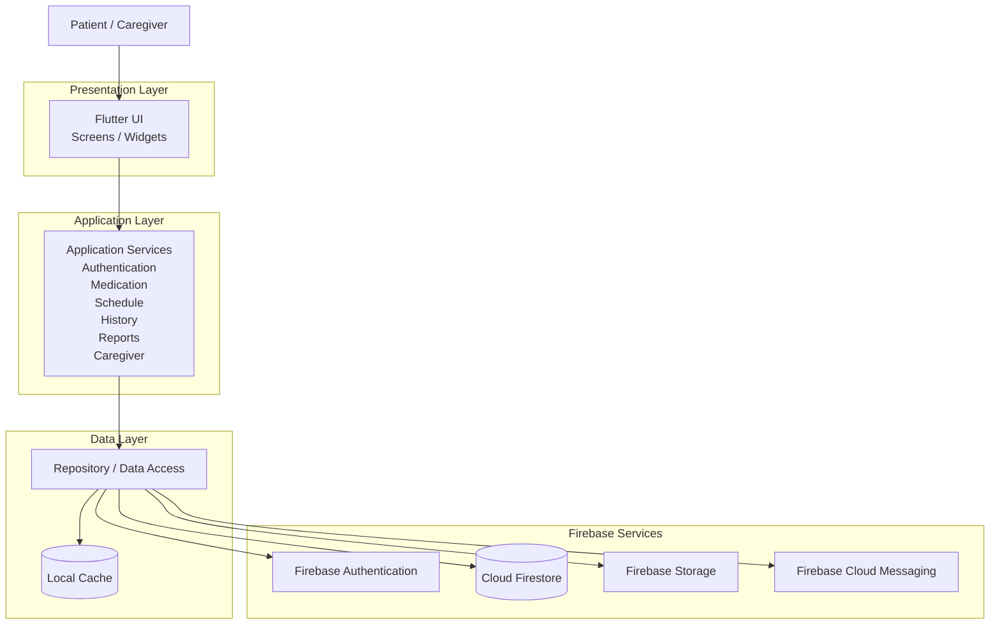

---

# 3. Authentication Flow

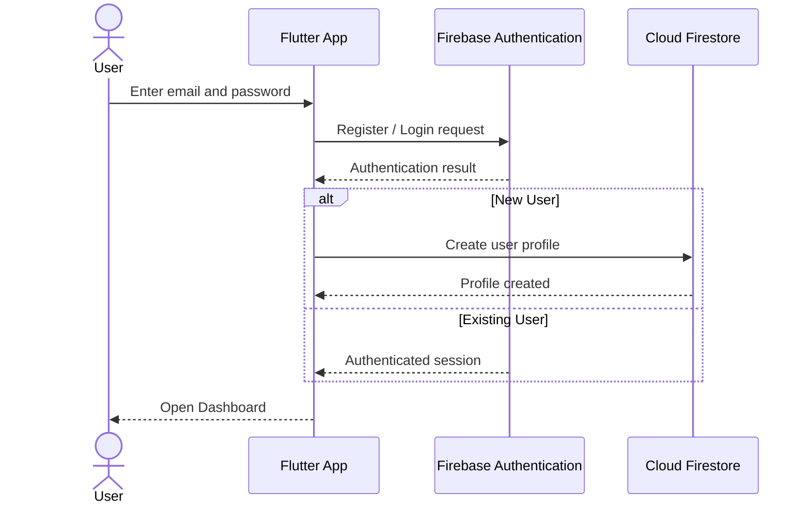

---

# 4. Medication Management Flow

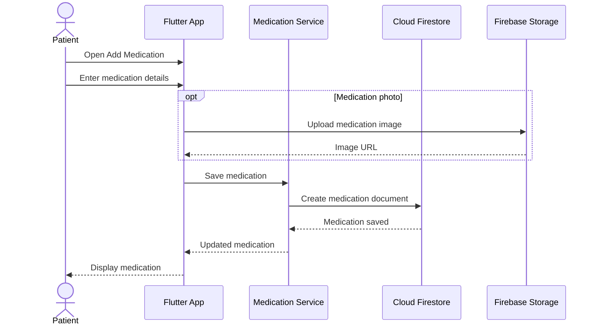

---

# 5. Medication Reminder Flow

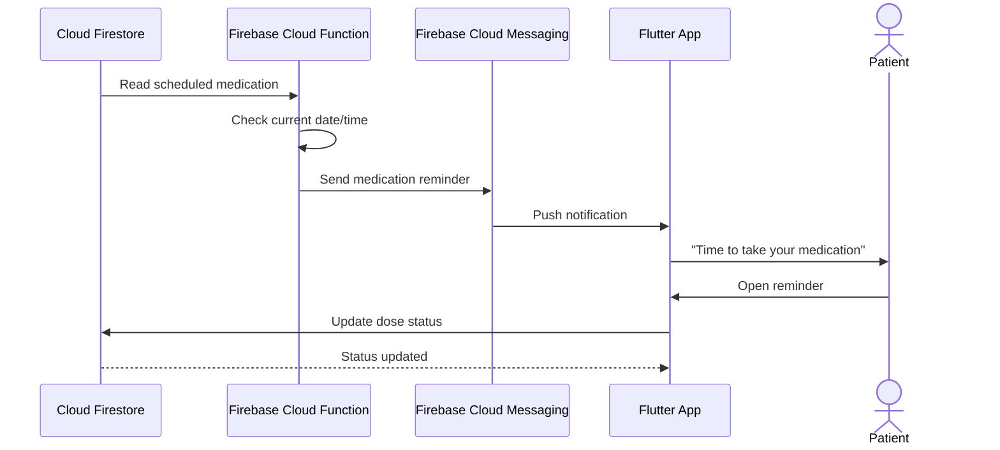

> **Implementation note:** The Cloud Function shown above should only be considered part of the implemented architecture if the team has actually configured Firebase Cloud Functions for scheduled processing.

---

# 6. Taken / Missed Dose Flow

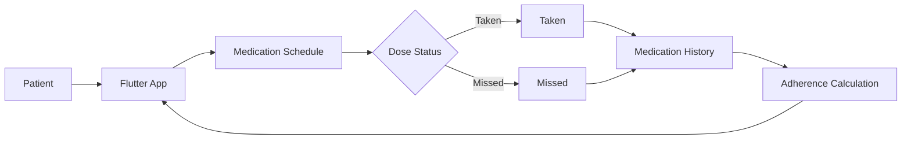

---

# 7. Offline Synchronization Flow

The application is required to support offline access and synchronize changes
when connectivity is restored.

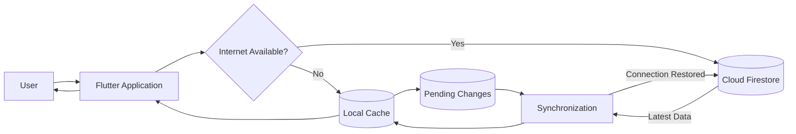

---

# 8. Caregiver Monitoring Flow

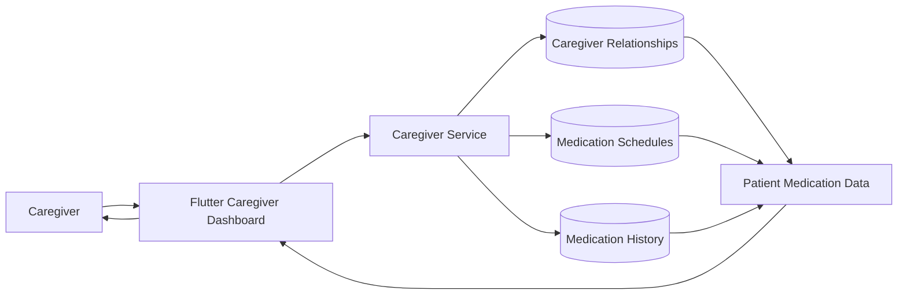

---

# 9. Report Generation Flow

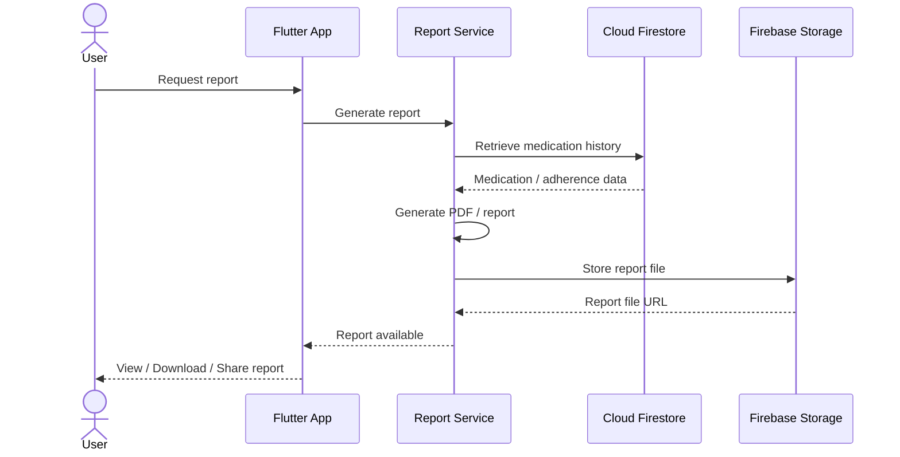

---

# 10. Data Model

The main persistent entities are:

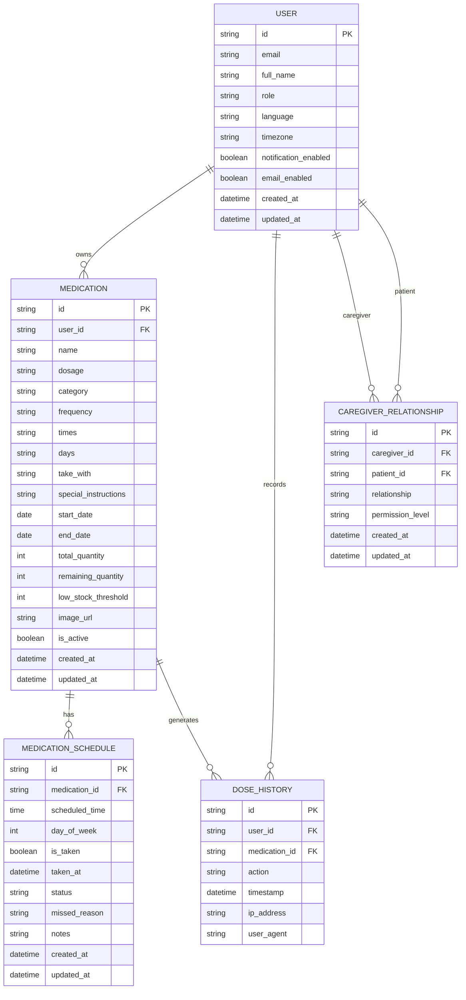

---

# 11. Technology Stack

| Layer | Technology |
|---|---|
| Mobile Application | Flutter |
| Programming Language | Dart |
| Authentication | Firebase Authentication |
| Database | Cloud Firestore |
| Push Notifications | Firebase Cloud Messaging |
| File Storage | Firebase Storage |
| Backend Services | Firebase |
| Server-side Processing | Firebase Cloud Functions |
| Hosting | Firebase Hosting |
| Local Data / Offline Support | Flutter local cache + Firestore offline capabilities |

---

# 12. Main System Flow

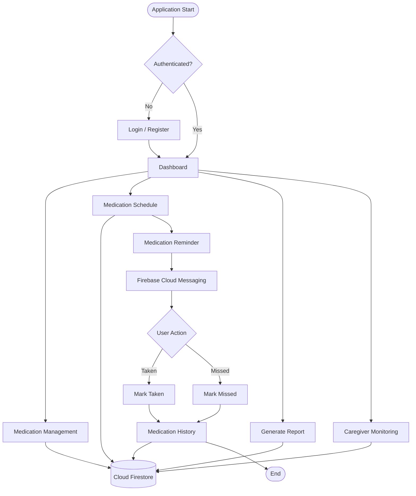

---

# 13. Security Boundary

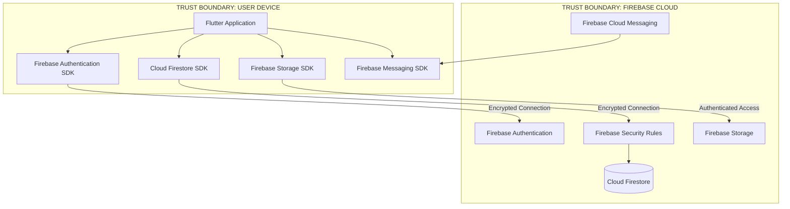

---

## Architecture Summary

The system uses **Flutter as the client application** and **Firebase as the cloud backend**. Firebase Authentication manages user authentication, Cloud Firestore stores application data, Firebase Storage stores files such as medication images and generated reports, and Firebase Cloud Messaging provides push notifications.

The Flutter application is organized into presentation, application, and data-access layers. Medication and schedule data can be cached locally to support intermittent connectivity, while synchronization keeps local data consistent with Cloud Firestore when connectivity is restored.

The architecture supports the major system modules: authentication, medication management, medication scheduling, reminders, adherence tracking, history, reporting, and caregiver monitoring.
