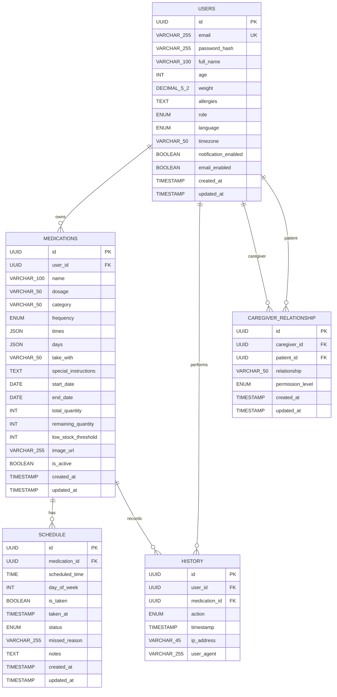

# Entity Relationship Diagram – Medication Reminder & Tracker App

```mermaid
erDiagram

    USERS {
        UUID id PK
        VARCHAR_255 email UK
        VARCHAR_255 password_hash
        VARCHAR_100 full_name
        INT age
        DECIMAL_5_2 weight
        TEXT allergies
        ENUM role
        ENUM language
        VARCHAR_50 timezone
        BOOLEAN notification_enabled
        BOOLEAN email_enabled
        TIMESTAMP created_at
        TIMESTAMP updated_at
    }

    MEDICATIONS {
        UUID id PK
        UUID user_id FK
        VARCHAR_100 name
        VARCHAR_50 dosage
        VARCHAR_50 category
        ENUM frequency
        JSON times
        JSON days
        VARCHAR_50 take_with
        TEXT special_instructions
        DATE start_date
        DATE end_date
        INT total_quantity
        INT remaining_quantity
        INT low_stock_threshold
        VARCHAR_255 image_url
        BOOLEAN is_active
        TIMESTAMP created_at
        TIMESTAMP updated_at
    }

    SCHEDULE {
        UUID id PK
        UUID medication_id FK
        TIME scheduled_time
        INT day_of_week
        BOOLEAN is_taken
        TIMESTAMP taken_at
        ENUM status
        VARCHAR_255 missed_reason
        TEXT notes
        TIMESTAMP created_at
        TIMESTAMP updated_at
    }

    HISTORY {
        UUID id PK
        UUID user_id FK
        UUID medication_id FK
        ENUM action
        TIMESTAMP timestamp
        VARCHAR_45 ip_address
        VARCHAR_255 user_agent
    }

    CAREGIVER_RELATIONSHIP {
        UUID id PK
        UUID caregiver_id FK
        UUID patient_id FK
        VARCHAR_50 relationship
        ENUM permission_level
        TIMESTAMP created_at
        TIMESTAMP updated_at
    }

    USERS ||--o{ MEDICATIONS : owns
    MEDICATIONS ||--o{ SCHEDULE : has
    USERS ||--o{ HISTORY : performs
    MEDICATIONS ||--o{ HISTORY : records
    USERS ||--o{ CAREGIVER_RELATIONSHIP : caregiver
    USERS ||--o{ CAREGIVER_RELATIONSHIP : patient
```
