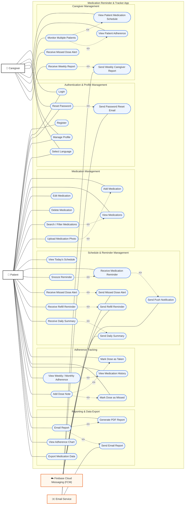

# Use Case Diagram – Medication Reminder & Tracker App

```mermaid
flowchart LR

    %% =====================================================
    %% ACTORS
    %% =====================================================

    PATIENT["👤 Patient"]
    CAREGIVER["👤 Caregiver"]
    FCM["☁️ Firebase Cloud Messaging (FCM)"]
    EMAIL["✉️ Email Service"]


    %% =====================================================
    %% SYSTEM BOUNDARY
    %% =====================================================

    subgraph SYSTEM["Medication Reminder & Tracker App"]

        direction TB


        %% =================================================
        %% AUTHENTICATION & PROFILE
        %% =================================================

        subgraph AUTH["Authentication & Profile Management"]

            UC01(["Register"])
            UC02(["Login"])
            UC03(["Reset Password"])
            UC04(["Manage Profile"])
            UC05(["Select Language"])

            UC03 -. "<<include>>" .-> UC06(["Send Password Reset Email"])

        end


        %% =================================================
        %% MEDICATION MANAGEMENT
        %% =================================================

        subgraph MED["Medication Management"]

            UC07(["Add Medication"])
            UC08(["View Medications"])
            UC09(["Edit Medication"])
            UC10(["Delete Medication"])
            UC11(["Search / Filter Medications"])
            UC12(["Upload Medication Photo"])

            UC12 -. "<<extend>>" .-> UC07
            UC11 -. "<<extend>>" .-> UC08

        end


        %% =================================================
        %% SCHEDULE & REMINDERS
        %% =================================================

        subgraph REM["Schedule & Reminder Management"]

            UC13(["View Today's Schedule"])
            UC14(["Receive Medication Reminder"])
            UC15(["Snooze Reminder"])
            UC16(["Receive Missed Dose Alert"])
            UC17(["Receive Refill Reminder"])
            UC18(["Receive Daily Summary"])

            UC19(["Send Push Notification"])
            UC20(["Send Missed Dose Alert"])
            UC21(["Send Refill Reminder"])
            UC22(["Send Daily Summary"])

            UC14 -. "<<include>>" .-> UC19
            UC16 -. "<<include>>" .-> UC20
            UC17 -. "<<include>>" .-> UC21
            UC18 -. "<<include>>" .-> UC22

            UC15 -. "<<extend>>" .-> UC14

        end


        %% =================================================
        %% ADHERENCE TRACKING
        %% =================================================

        subgraph ADH["Adherence Tracking"]

            UC23(["Mark Dose as Taken"])
            UC24(["Mark Dose as Missed"])
            UC25(["View Medication History"])
            UC26(["View Weekly / Monthly Adherence"])
            UC27(["Add Dose Note"])

            UC26 -. "<<include>>" .-> UC25

            UC27 -. "<<extend>>" .-> UC23
            UC27 -. "<<extend>>" .-> UC24

        end


        %% =================================================
        %% REPORTING & DATA EXPORT
        %% =================================================

        subgraph REP["Reporting & Data Export"]

            UC28(["Generate PDF Report"])
            UC29(["Email Report"])
            UC30(["View Adherence Chart"])
            UC31(["Export Medication Data"])

            UC32(["Send Email Report"])

            UC29 -. "<<include>>" .-> UC28
            UC29 -. "<<include>>" .-> UC32

        end


        %% =================================================
        %% CAREGIVER MANAGEMENT
        %% =================================================

        subgraph CAR["Caregiver Management"]

            UC33(["View Patient Medication Schedule"])
            UC34(["View Patient Adherence"])
            UC35(["Monitor Multiple Patients"])
            UC36(["Receive Missed Dose Alert"])
            UC37(["Receive Weekly Report"])

            UC38(["Send Weekly Caregiver Report"])

            UC35 -. "<<include>>" .-> UC33
            UC35 -. "<<include>>" .-> UC34

            UC37 -. "<<include>>" .-> UC38

        end

    end


    %% =====================================================
    %% PATIENT ASSOCIATIONS
    %% =====================================================

    PATIENT --- UC01
    PATIENT --- UC02
    PATIENT --- UC03
    PATIENT --- UC04
    PATIENT --- UC05

    PATIENT --- UC07
    PATIENT --- UC08
    PATIENT --- UC09
    PATIENT --- UC10
    PATIENT --- UC11
    PATIENT --- UC12

    PATIENT --- UC13
    PATIENT --- UC14
    PATIENT --- UC15
    PATIENT --- UC16
    PATIENT --- UC17
    PATIENT --- UC18

    PATIENT --- UC23
    PATIENT --- UC24
    PATIENT --- UC25
    PATIENT --- UC26
    PATIENT --- UC27

    PATIENT --- UC28
    PATIENT --- UC29
    PATIENT --- UC30
    PATIENT --- UC31


    %% =====================================================
    %% CAREGIVER ASSOCIATIONS
    %% =====================================================

    CAREGIVER --- UC02
    CAREGIVER --- UC03
    CAREGIVER --- UC04
    CAREGIVER --- UC05

    CAREGIVER --- UC33
    CAREGIVER --- UC34
    CAREGIVER --- UC35
    CAREGIVER --- UC36
    CAREGIVER --- UC37


    %% =====================================================
    %% FCM ASSOCIATIONS
    %% =====================================================

    FCM --- UC19
    FCM --- UC20
    FCM --- UC21
    FCM --- UC22


    %% =====================================================
    %% EMAIL SERVICE ASSOCIATIONS
    %% =====================================================

    EMAIL --- UC06
    EMAIL --- UC32
    EMAIL --- UC38


    %% =====================================================
    %% STYLING
    %% =====================================================

    classDef actor fill:#ffffff,stroke:#222222,stroke-width:2px;
    classDef external fill:#fff7ed,stroke:#ea580c,stroke-width:2px;
    classDef usecase fill:#eef5ff,stroke:#2563eb,stroke-width:1.5px;

    class PATIENT,CAREGIVER actor;
    class FCM,EMAIL external;

    class UC01,UC02,UC03,UC04,UC05,UC06 usecase;
    class UC07,UC08,UC09,UC10,UC11,UC12 usecase;
    class UC13,UC14,UC15,UC16,UC17,UC18,UC19,UC20,UC21,UC22 usecase;
    class UC23,UC24,UC25,UC26,UC27 usecase;
    class UC28,UC29,UC30,UC31,UC32 usecase;
    class UC33,UC34,UC35,UC36,UC37,UC38 usecase;
```
