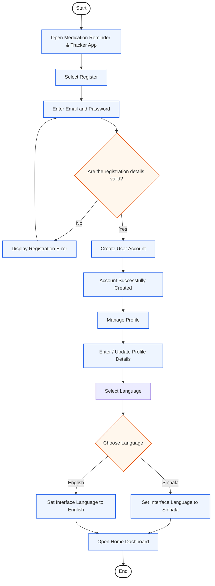
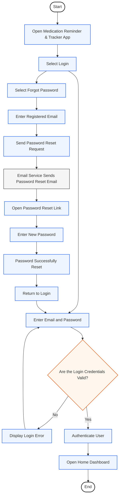
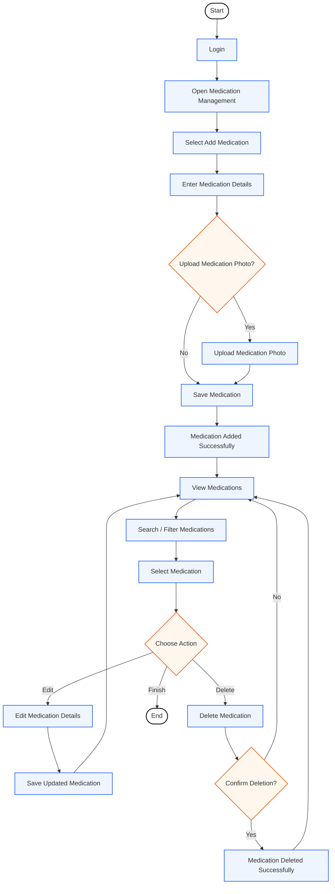
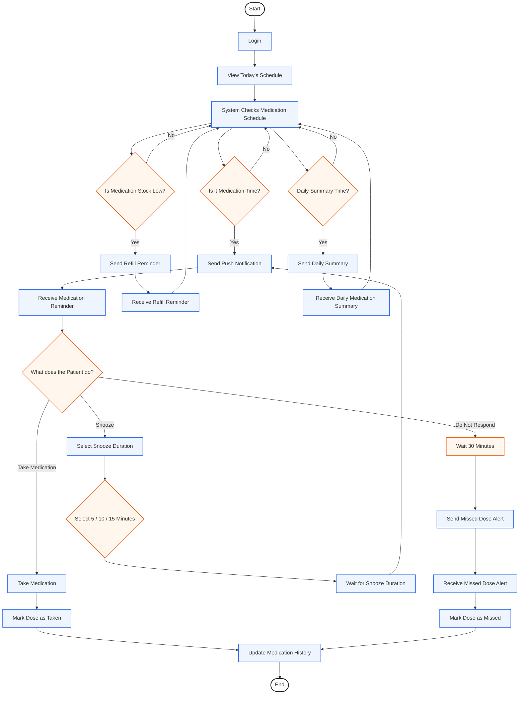
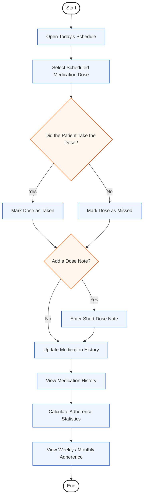
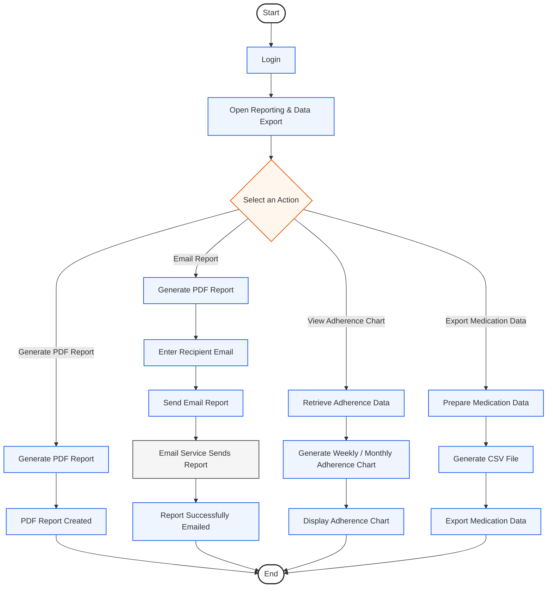
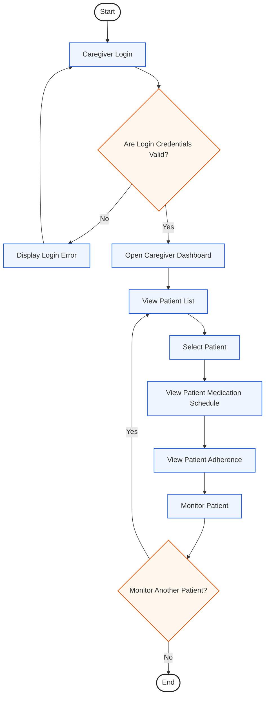

## User Journey Flows
### Registration & Account Setup

### Login & Password Recovery 

### Medication Management

### Medication Schedule & Reminder

### Dose Tracking & Adherence

### Report Generation & Data Export

### Caregiver Patient Monitoring

